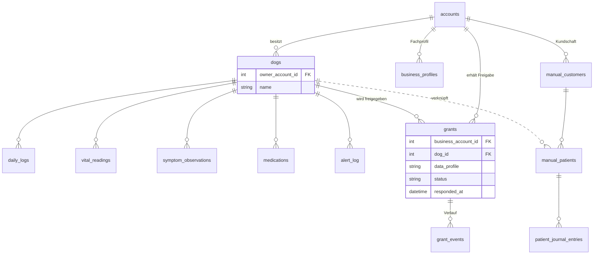
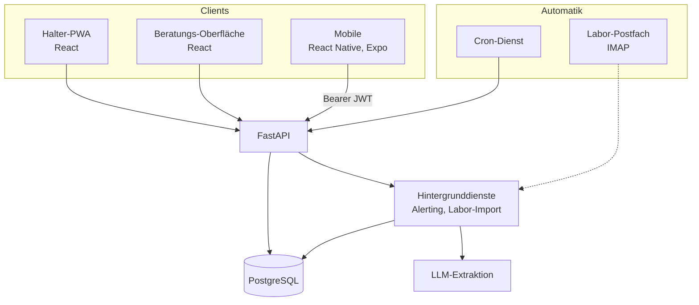

# FHIS: Monitoring für Tiergesundheit

**Ein Gesundheitsverlauf für Tiere, den Halterinnen führen und Fachleute lesen dürfen, aber nur was freigegeben wurde.**

Seit September 2026 mit erster Testkundin aus der Ernährungsberatung im Feldeinsatz. Gebaut als Einzelperson neben Studium und Werkstudentenstelle.

Der Quellcode ist nicht öffentlich. Diese Seite beschreibt Aufbau, Entscheidungen und Stand.

> **Demo-Video:** _folgt_ · **Screenshots:** _folgen_

---

## Das Problem

Wer den Gesundheitsverlauf eines Tieres über Monate verfolgen will, führt das in einem Notizbuch oder gar nicht. Tierärztinnen und Ernährungsberaterinnen bekommen im Termin die Erinnerungsleistung des Halters zu hören, keine Daten.

Ich bin darauf gestoßen, weil ich den Verlauf meiner eigenen Hündin dokumentieren wollte und nichts gefunden habe, das über eine Notiz-App hinausgeht.

## Das Datenmodell

Die interessante Tabelle ist `grants`. Sie ist der Grund, warum das System kein weiterer Gesundheitstracker ist.

*Vereinfachte Darstellung der Kernbeziehungen. Das vollständige Schema umfasst 21 Tabellen und wird im Projekt aus den ORM-Metadaten **generiert**, nicht von Hand gezeichnet.*

**Was daran zählt:** Eine Beraterin bekommt keinen Zugriff auf einen Hund, sondern eine Freigabe mit Datenprofil, Status und Widerrufszeitpunkt. Entzieht die Halterin sie, bleibt der Verlauf in `grant_events` nachvollziehbar, die Daten sind aber sofort unerreichbar. Praxen führen daneben eigene Patienten ohne App-Account: dieselbe Oberfläche, andere Herkunft der Daten.

## Architektur

## Funktionsumfang

| | |
|---|---|
| **Tägliche Erfassung** | Vitalwerte, Symptome, Fütterung, Medikation, Behandlungsprotokolle |
| **Freigaben** | pro Datenprofil, jederzeit widerrufbar, mit Verlaufsprotokoll |
| **Alerting** | Cron-basiert: ausbleibende Einträge und auffällige Verläufe |
| **Laborimport** | IMAP-Postfach, LLM-gestützte Extraktion, Zuordnung zum Patienten |
| **Risikobewertung** | eigenes Modell auf den erfassten Verlaufsdaten |

## Entscheidungen, auf die es ankam

**Fremde Datensätze antworten mit 404, nicht mit 403.** IDs sind fortlaufende Ganzzahlen. Wer bei fremden Zeilen „verboten" und bei nicht existierenden „nicht gefunden" antwortet, hat ein Existenz-Orakel gebaut: Man zählt hoch und weiß, welche IDs vergeben sind. 403 bleibt für „angemeldet, falsche Rolle" reserviert. Diese Auskunft steht ohnehin im Token des Aufrufers.

**Vier getrennte Auth-Klassen statt einer Rollenspalte.** Halter-Sitzung, Beratungs-Sitzung, statischer Maschinenschlüssel und ein Cron-Geheimnis. Die statischen Schlüssel sind keine Altlast: Hinter einem Cron-Job steht kein Account, dem man ein Token ausstellen könnte, und ein JWT liefe nach sieben Tagen ab.

**Das ER-Diagramm wird erzeugt, nicht gepflegt.** Ein Skript liest die ORM-Metadaten, dieselben mit denen die Anwendung läuft, und ersetzt den Block im Architekturdokument. Eine neue Tabelle, die nicht eindeutig als Halter- oder Beratungstabelle klassifiziert ist, erzeugt absichtlich eine sichtbare Warnung. Handgezeichnete Diagramme driften, und ein Diagramm das lügt ist schlechter als keins.

**Zwei Protokolle statt eines Wikis.** Ein Entscheidungsprotokoll, das nur angehängt und nie überschrieben wird, und ein Architekturdokument, das immer nur den Ist-Stand beschreibt. Sie beantworten verschiedene Fragen: „warum damals" und „wie jetzt". In einem Dokument vermischt, wird eins von beidem unbrauchbar.

## Was der Feldeinsatz gelehrt hat

Der erste echte Befund nach dem Termin mit der Testkundin war kein Bug, sondern eine Lücke: Sie hatte sich bei der Registrierung vertippt und kam nicht mehr rein, denn **es gab keinen Passwort-vergessen-Flow**. Also musste jemand von Hand an die Produktionsdatenbank, während eine Kundin am Telefon wartete.

Der Reflex, die Accounts einfach zu löschen und neu anzulegen, war ebenfalls falsch: Am Halter-Account hingen bereits drei Hunde. Der Weg war ein gezieltes Zurücksetzen mit Entwertung der alten Sitzungen.

Zwei Lehren, die kein Testlauf geliefert hätte: Der Vertipper bei der *Registrierung* sperrt aus, der beim *Login* nicht. Beide sehen von außen gleich aus und verlangen völlig verschiedene Reaktionen. Und: Fehlende Wiederherstellungswege fallen erst auf, wenn der erste Mensch davorsteht, der nicht der Entwickler ist.

## Stack

`Python` `FastAPI` `SQLAlchemy` `Alembic` `PostgreSQL` `React` `TypeScript` `React Native` `Expo` `Docker` `scikit-learn`

## Kontakt

Tim Walther · timalexanderwalther@gmail.com
